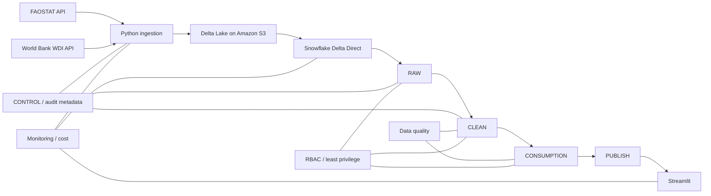
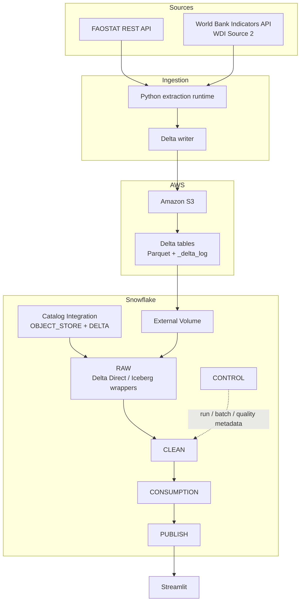

# Architecture Overview

## 1. Purpose

This document defines Architecture v1 for the Global Food Security & Nutrition Intelligence Platform. It translates the Phase 2 source findings into a production-oriented architecture for FAOSTAT and World Bank WDI ingestion, Delta Lake storage on Amazon S3, Snowflake processing, and Streamlit consumption.

## 2. Architectural Principles

1. Source semantics are preserved before business transformation.
2. Delta Lake on Amazon S3 is the persistent raw storage and replay boundary.
3. Parquet is the physical data-file format; Delta transaction logs provide table metadata and version history.
4. Python performs extraction and storage serialization only. Business standardization begins in Snowflake CLEAN.
5. Historical source revisions are expected and must remain auditable.
6. Snowflake separates RAW, CLEAN, CONSUMPTION, PUBLISH, and CONTROL responsibilities.
7. Cross-source country integration uses governed ISO3 identity.
8. Ingestion is idempotent at the batch boundary.
9. Consumers never access RAW directly.
10. Security, observability, cost control, and data quality are cross-cutting concerns.

## 3. Logical Architecture



## 4. Physical Architecture



The RAW Snowflake objects are read-only Delta Direct tables over Delta files in S3. CLEAN and downstream layers are Snowflake-managed objects. The exact transformation/orchestration technology is intentionally deferred until Phase 12.

## 5. Storage Layout

Each logical source dataset is a Delta table with one table root and one `_delta_log` directory.

```text
raw/
  faostat/
    qcl/
      _delta_log/
      year=2010/
      ...
      year=2023/
    lc/
    esb/
    fbs/
    gt/
    fs/
      _delta_log/
      reference_year=2010/
      ...
      reference_year=2023/
  world_bank/
    wdi_observations/
      _delta_log/
      year=2010/
      ...
      year=2023/
    wdi_indicator_metadata/
      _delta_log/
```

`year` and `reference_year` are storage partition columns only where appropriate. Source period fields remain present in the dataset and are never replaced by the partition value.

## 6. Layer Responsibilities

### RAW

RAW is the source-faithful, read-only interface over Delta tables stored in S3. Python may serialize source records into typed Delta-compatible columns and add technical lineage columns, but does not apply business cleaning, unit conversion, code remapping, deduplication across source snapshots, or analytical filtering.

The architecture intentionally preserves source data semantics rather than the literal HTTP wire representation. This is an explicit project decision recorded in ADR-003.

### CLEAN

CLEAN standardizes names and types, validates source contracts, normalizes geography, interprets provenance flags, derives explicit temporal fields for FS, handles malformed records, validates source-level uniqueness, and resolves the accepted current observation state.

### CONSUMPTION

CONSUMPTION exposes conformed, business-ready datasets for cross-domain analytics. It applies governed source scope, country integration, compatible unit semantics, and analytical grains. The final dimensional model remains Phase 10 work.

### PUBLISH

PUBLISH exposes stable consumer-facing views or tables for Streamlit and future clients. Applications depend on PUBLISH, not RAW or implementation-specific CLEAN objects.

### CONTROL

CONTROL stores ingestion runs, ingestion batches, Delta commit/version references, schema observations, data-quality results, refresh status, and operational metadata.

## 7. Environment and Object Convention

Logical environment databases:

```text
GFS_DEV
GFS_TEST
GFS_PROD
```

Logical schemas:

```text
RAW
CLEAN
CONSUMPTION
PUBLISH
CONTROL
```

Physical object creation, warehouse sizing, and grants are Phase 4 responsibilities.

## 8. Refresh Model

The v1 expected cadence is monthly scheduled ingestion with controlled on-demand backfills. Because FAOSTAT and WDI are revision-capable, configured 2010-2023 history may be re-extracted rather than treating the sources as append-only.

A new successful extraction appends a new source snapshot identified by run and batch metadata. CLEAN resolves the accepted current state without deleting earlier RAW lineage.

## 9. Delta Compatibility Guardrails

The ingestion writer uses a conservative Delta feature set to remain compatible with Snowflake Delta Direct:

- primitive and supported nested types only;
- decimal precision never above 38;
- no deletion vectors;
- no row tracking;
- no Delta CDC/change-data features;
- no protocol feature that Snowflake Delta Direct does not support;
- additive schema evolution only after contract validation.

Because the RAW Delta tables are partitioned, Phase 12 orchestration must not depend on Snowflake Streams directly on those partitioned Delta Direct tables.

## 10. Deferred Decisions

- exact Snowflake warehouse sizes;
- exact production scheduler/runtime;
- Streams vs Tasks vs Dynamic Tables for downstream processing;
- final dimensional/star schema;
- final KPI definitions and Streamlit layout.
