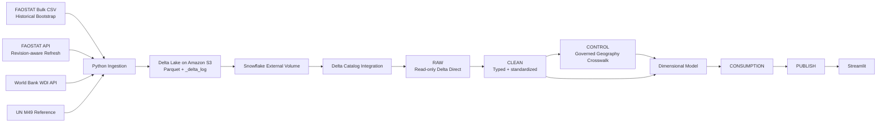

# Architecture Overview

## Purpose

The platform integrates agricultural production, food availability, land/environmental pressure, food-security indicators, and socioeconomic context into a production-style analytical platform built with AWS, Delta Lake, Snowflake, Python, and Streamlit.

The v1 analytical window is **2010–2023**.

## Logical architecture

## Layer responsibilities

### Delta Lake / S3
- Durable landing state for FAOSTAT, World Bank, and reference datasets.
- Source-preserving records plus technical ingestion metadata.
- Delta transaction log provides table state and recovery history.

### RAW
- Read-only Snowflake representation of external Delta tables.
- No business standardization.
- Preserves source payloads and ingestion lineage.

### CLEAN
- Parses semi-structured source payloads.
- Normalizes headers to `snake_case`.
- Applies safe typing with `TRY_TO_*` semantics.
- Preserves nulls instead of converting missing observations to zero.
- Retains source lineage.
- Models domain-specific grain explicitly.

### CONTROL
- DQ audit history.
- Rejected-record quarantine.
- Governed geography crosswalk.
- Manual overrides and intentionally not-applicable mappings.

### CONSUMPTION / PUBLISH
- Business-ready dimensions, facts, marts, KPI views, and Streamlit-facing structures.

## Environment

- S3 Delta root: `s3://gfs-delta-dev-kush01/delta/`
- S3 region: `ap-south-1`
- Snowflake deployment region observed during setup: `AWS_AP_SOUTHEAST_7`
- DEV database: `GFS_DEV`
- Main schemas: `RAW`, `CLEAN`, `CONSUMPTION`, `PUBLISH`, `CONTROL`

## Core modeling principles

1. **Codes define identity; names are attributes.** Name variants do not create new business entities.
2. **RAW preserves source semantics.** CLEAN standardizes but does not rewrite source history.
3. **Null is not zero.** Missing observations remain missing.
4. **Domain grain is evidence-driven.** Similar-looking schemas can still represent different grains.
5. **Cross-source joins use governed keys.** FAOSTAT and WDI are not joined by country name.
6. **Historical data is revision-capable.** Refresh design must allow source revisions to prior years.
7. **Not all areas are countries.** Regions, economic groups, historical areas, and unsupported territories remain explicitly classified rather than force-mapped.
