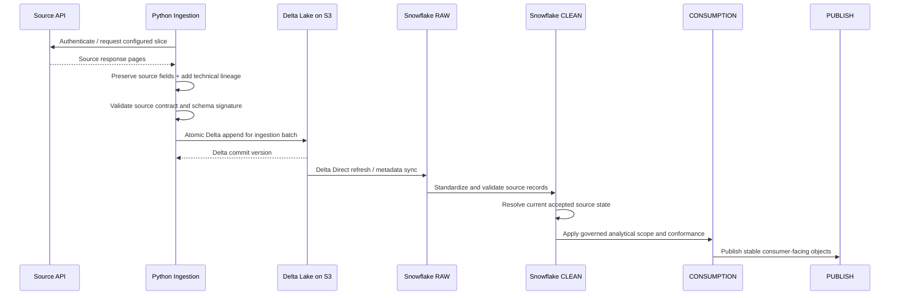
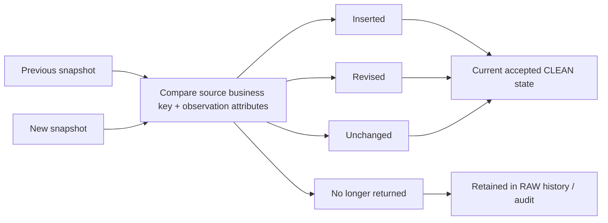
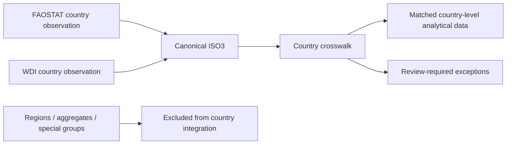

# Source-to-Target Data Flow

## 1. End-to-End Flow



## 2. Delta Table Roots

A Delta table owns its root directory. Run IDs are stored as columns, not as independent Delta roots.

Examples:

```text
s3://<bucket>/raw/faostat/qcl/
s3://<bucket>/raw/faostat/lc/
s3://<bucket>/raw/faostat/esb/
s3://<bucket>/raw/faostat/fbs/
s3://<bucket>/raw/faostat/gt/
s3://<bucket>/raw/faostat/fs/
s3://<bucket>/raw/world_bank/wdi_observations/
s3://<bucket>/raw/world_bank/wdi_indicator_metadata/
```

Annual observation tables use `year=YYYY` partitions. FS uses `reference_year=YYYY` while retaining the provider's original annual or multi-year period fields.

## 3. Ingestion Unit

The transactional ingestion unit is a source/domain/year batch where annual partitioning exists. Each batch receives:

```text
ingestion_run_id
ingestion_batch_id
source_system
source_domain
extracted_at_utc
contract_version
schema_signature
record_count
record_hash
```

A batch is appended to Delta once. If a retry occurs, the writer checks whether the same `ingestion_batch_id` is already committed before writing again.

## 4. Replay Boundary

Delta Lake on S3 is the replay boundary. Snowflake RAW can be reconstructed or refreshed from persisted Delta tables without another API call when the required source snapshot remains present.

Delta transaction history provides storage-level versioning. Run/batch metadata provides business and operational lineage across source refreshes.

## 5. Revision Flow



Cross-run identical observations are valid snapshots and are not transport duplicates.

## 6. Country Integration Flow



Automatic fuzzy matching on country names is prohibited.
