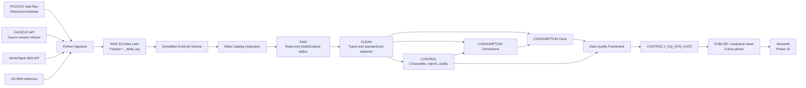

# Architecture and Data Flow

## Current architecture through Phase 11



## Storage roots

```text
delta/
  faostat/qcl/
  faostat/lc/
  faostat/esb/
  faostat/fbs/
  faostat/gt/
  faostat/fs/
  world_bank/wdi_observations/
  world_bank/wdi_indicator_metadata/
  world_bank/wdi_entity_metadata/
  reference/un_m49/
```

## Layer responsibilities

### RAW

Read-only exposure of landed Delta data. Source fidelity is prioritized over convenience.

### CLEAN

Typed, standardized, source-aware datasets with controlled reject handling and lineage.

### CONTROL

Operational and governance objects such as geography crosswalks, rejected records, audit structures, DQ run history, detailed DQ results, and the pipeline quality gate.

### CONSUMPTION

Dimensional facts and dimensions designed for analytical joins and future dashboard/view development.

### Data Quality

A persisted validation layer checks structural integrity, analytical scope, source-target reconciliation, and selected business-semantic rules. Results are summarized into a pipeline gate for Phase 12 orchestration.

### PUBLISH

Reserved for curated analytical views and dashboard-facing datasets in later phases.
