# Consumption-Layer Dimensional Model

## Overview

The consumption model uses shared dimensions where the business identity is genuinely conformed and domain-aware dimensions where FAOSTAT codes are not proven globally interchangeable.

```mermaid
erDiagram

    DIM_GEOGRAPHY ||--o{ FACT_CROPS_LIVESTOCK : geography_key
    DIM_DATE ||--o{ FACT_CROPS_LIVESTOCK : date_key
    DIM_ITEM ||--o{ FACT_CROPS_LIVESTOCK : item_key
    DIM_ELEMENT ||--o{ FACT_CROPS_LIVESTOCK : element_key

    DIM_GEOGRAPHY ||--o{ FACT_LAND_COVER : geography_key
    DIM_DATE ||--o{ FACT_LAND_COVER : date_key
    DIM_ITEM ||--o{ FACT_LAND_COVER : item_key
    DIM_ELEMENT ||--o{ FACT_LAND_COVER : element_key

    DIM_GEOGRAPHY ||--o{ FACT_NUTRIENT_BALANCE : geography_key
    DIM_DATE ||--o{ FACT_NUTRIENT_BALANCE : date_key
    DIM_ITEM ||--o{ FACT_NUTRIENT_BALANCE : item_key
    DIM_ELEMENT ||--o{ FACT_NUTRIENT_BALANCE : element_key

    DIM_GEOGRAPHY ||--o{ FACT_FOOD_BALANCE : geography_key
    DIM_DATE ||--o{ FACT_FOOD_BALANCE : date_key
    DIM_ITEM ||--o{ FACT_FOOD_BALANCE : item_key
    DIM_ELEMENT ||--o{ FACT_FOOD_BALANCE : element_key

    DIM_GEOGRAPHY ||--o{ FACT_EMISSIONS : geography_key
    DIM_DATE ||--o{ FACT_EMISSIONS : date_key
    DIM_ITEM ||--o{ FACT_EMISSIONS : item_key
    DIM_ELEMENT ||--o{ FACT_EMISSIONS : element_key
    DIM_SOURCE ||--o{ FACT_EMISSIONS : source_key

    DIM_GEOGRAPHY ||--o{ FACT_FOOD_SECURITY : geography_key
    DIM_INDICATOR ||--o{ FACT_FOOD_SECURITY : indicator_key
    DIM_ELEMENT ||--o{ FACT_FOOD_SECURITY : element_key
    DIM_PERIOD ||--o{ FACT_FOOD_SECURITY : period_key

    DIM_GEOGRAPHY ||--o{ FACT_WDI : geography_key
    DIM_DATE ||--o{ FACT_WDI : date_key
    DIM_INDICATOR ||--o{ FACT_WDI : indicator_key
```

## Grain matrix

| Fact | Business grain |
|---|---|
| `FACT_CROPS_LIVESTOCK` | Geography x Item x Element x Year |
| `FACT_LAND_COVER` | Geography x Item x Element x Year |
| `FACT_NUTRIENT_BALANCE` | Geography x Item x Element x Year |
| `FACT_FOOD_BALANCE` | Geography x Item x Element x Year |
| `FACT_EMISSIONS` | Geography x Item x Element x Source x Year |
| `FACT_FOOD_SECURITY` | Geography x Indicator x Element x Period |
| `FACT_WDI` | Mapped Geography x Indicator x Year |

## Conformance rules

`DIM_GEOGRAPHY` is the principal cross-source conformed dimension. It allows FAOSTAT and World Bank facts to resolve to the same analytical geography.

`DIM_ITEM` and `DIM_ELEMENT` are shared physical dimensions but are domain-aware. Their natural identity includes `source_domain` because profiling did not prove cross-domain code reuse.

`DIM_INDICATOR` is source-aware. FAOSTAT and World Bank indicators share one analytical dimension while retaining separate code namespaces.

`DIM_DATE` handles annual observations. `DIM_PERIOD` handles interval-style FAOSTAT FS observations.

## Key strategy

- Geography, item, element, indicator, source, and period dimensions use generated surrogate keys.
- Date uses a deterministic year key.
- Facts do not require separate synthetic fact keys.
- `source_row_hash` provides source-observation identity and supports idempotent `MERGE` loading.

## SCD strategy

Dimensions currently use SCD Type 1. Historical source preservation remains available in RAW and CLEAN layers.
