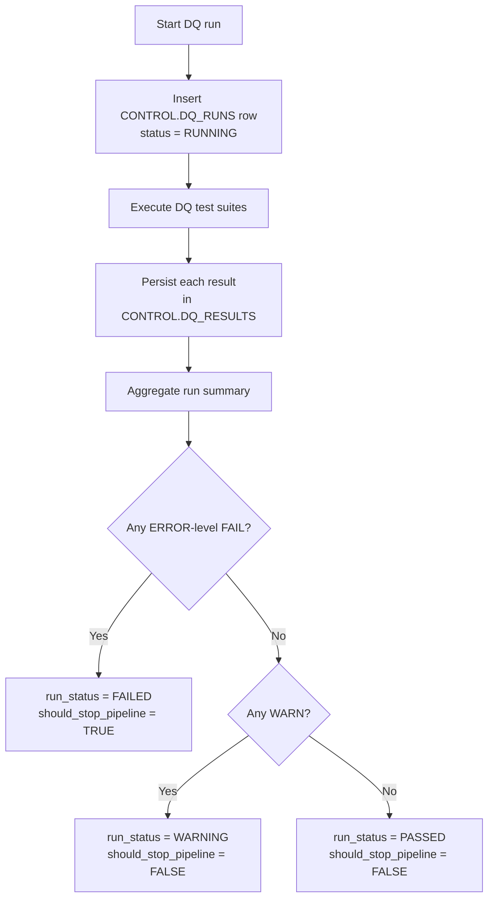

# Data Quality Framework

## Purpose

The data-quality layer provides a repeatable contract between transformed data and downstream consumption. It records what was tested, what was expected, what was observed, and whether orchestration may continue.

## Control objects

### `CONTROL.DQ_RUNS`

Execution-level audit table.

Typical fields:

- `dq_run_id`
- `run_status`
- `started_at_utc`
- `completed_at_utc`
- `total_tests`
- `passed_tests`
- `warning_tests`
- `failed_tests`

### `CONTROL.DQ_RESULTS`

Test-level audit table.

Typical fields:

- `dq_run_id`
- `test_name`
- `test_category`
- `target_object`
- `target_column`
- `severity`
- `expected_value`
- `observed_value`
- `test_status`
- `failure_count`
- `test_message`
- `executed_at_utc`

### `CONTROL.V_DQ_RUN_GATE`

Orchestration-facing view. It exposes the final run status and a `should_stop_pipeline` flag.

## Execution flow

## Severity model

| Severity | Intended meaning | Pipeline behavior |
|---|---|---|
| `ERROR` | Violates a required data contract | Stop when failed |
| `WARNING` | Requires review but may be acceptable | Continue |
| `INFO` | Observability-only signal | Continue |

## Test design principles

- Test declared business grain, not arbitrary combinations of columns.
- Reconcile against the intended analytical scope, not necessarily every source row.
- Keep source-specific exceptions explicit.
- Prefer defensible business rules over broad generic thresholds.
- Persist both passing and failing results to preserve evidence of execution.
- Keep DQ policy separate from transformation SQL so orchestration can consume a single run gate.
