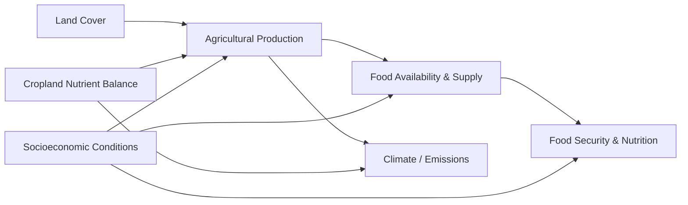

# Global Food Security & Nutrition Intelligence Platform

## Project Charter

### 1. Purpose

The Global Food Security & Nutrition Intelligence Platform is a production-style data engineering project that integrates agricultural, environmental, food-supply, food-security, and socioeconomic data into a governed analytical platform.

The platform is designed to demonstrate end-to-end engineering practices across API ingestion, AWS S3 landing, Snowflake data modeling, data quality, orchestration, security, monitoring, CI/CD, and analytical consumption.

### 2. Business Problem

Food security cannot be understood from a single metric. Agricultural resources, production, food availability, environmental pressure, nutrition outcomes, and socioeconomic conditions interact across countries and over time.

Public datasets contain these signals, but they are distributed across domains, use different grains and coding systems, expose inconsistent provenance metadata, and may contain estimated, imputed, suppressed, external-source, or missing observations.

The project will create a reproducible data platform that preserves those source semantics while exposing curated analytical datasets for cross-domain analysis.

### 3. Objectives

- Ingest selected FAOSTAT domains and World Bank World Development Indicators through APIs.
- Preserve source payloads and provenance in a replayable raw layer.
- Standardize geography, time, codes, units, and value-quality metadata in curated layers.
- Build integrated country-level analytical models for the common period 2010-2023.
- Implement explicit data-quality controls instead of silently coercing source anomalies.
- Support analytical exploration through Snowflake and Streamlit.
- Demonstrate production practices including idempotency, observability, cost awareness, security, CI/CD, and failure recovery.

### 4. Analytical Story

The arrows represent analytical relationships to investigate. They must not be interpreted as proof of causality.

### 5. Data Sources

#### FAOSTAT

The project uses the following FAOSTAT domains:

| Pillar | Domain | Code |
|---|---|---|
| Resources | Land Cover | LC |
| Sustainability | Cropland Nutrient Balance | ESB |
| Production | Crops and livestock products | QCL |
| Food Supply | Food Balances (2010-) | FBS |
| Climate | Emissions totals | GT |
| Food Security & Nutrition | Suite of Food Security Indicators | FS |

FAOSTAT is the primary domain source. Its API requires bearer-token authentication for protected endpoints.

#### World Bank

The socioeconomic enrichment source is the World Bank World Development Indicators database, Source ID 2.

The initial v1 indicator set is:

| Indicator Code | Indicator |
|---|---|
| SP.POP.TOTL | Population, total |
| NY.GDP.MKTP.CD | GDP (current US$) |
| NY.GDP.PCAP.CD | GDP per capita (current US$) |
| SP.RUR.TOTL.ZS | Rural population (% of total population) |
| NV.AGR.TOTL.ZS | Agriculture, forestry, and fishing, value added (% of GDP) |

### 6. Time Scope

The integrated analytical period is **2010-2023**.

This range is intentionally selected as the common historical window for v1. Pre-2010 observations are out of scope. GT future projections for 2030 and 2050 are also out of scope for v1 analytical facts.

FAOSTAT FS may expose annual and multi-year period observations. Those are preserved with their original temporal semantics rather than forced into a single annual representation.

### 7. Intended Users

- Data engineers reviewing ingestion, modeling, orchestration, testing, and governance patterns.
- Analysts exploring food-security and agricultural trends.
- Technical reviewers evaluating a production-style Snowflake and AWS portfolio implementation.

### 8. Candidate Analytical Questions

The final analytical questions will be constrained by the curated FAOSTAT item and element allowlists defined in the source contracts. Candidate questions include:

1. How do changes in land use and cropland nutrient inputs relate to agricultural production across countries and years?
2. Which countries show improving or deteriorating nutrient-use efficiency relative to agricultural output?
3. How does domestic agricultural production compare with food availability and import dependence?
4. How do agricultural production patterns relate to emissions intensity and total agricultural emissions?
5. How do food-security and nutrition indicators evolve across the 2010-2023 period?
6. How do GDP per capita, rural population share, agricultural value added, and population relate to food-supply and food-security outcomes?

No causal claim will be made solely from statistical association.

### 9. In Scope

- API-based source discovery and ingestion.
- AWS S3 as the cloud landing zone.
- Snowflake as the analytical warehouse.
- RAW, CLEAN, and consumption-oriented layers.
- Source metadata and provenance preservation.
- Historical revision-aware ingestion design.
- Data quality and reconciliation checks.
- Snowflake security and RBAC.
- Monitoring and cost controls.
- Streamlit consumption.
- GitHub Actions CI/CD.
- Production failure drills and recovery documentation.

### 10. Out of Scope for v1

- Pre-2010 integrated history.
- GT 2030 and 2050 projections in the primary analytical model.
- Causal inference.
- Real-time streaming claims for annual statistical datasets.
- WHO enrichment unless added as a later stretch scope.
- Silent replacement of null, suppressed, estimated, imputed, or external-source values.

### 11. Success Criteria

The project is successful when:

- All selected source datasets can be ingested reproducibly and replayed.
- Source provenance and quality flags remain traceable to consumption outputs.
- Data is standardized without losing source meaning.
- Duplicate and grain violations are detected explicitly.
- Historical revisions can be handled without relying only on `year > max_loaded_year` logic.
- Curated analytical models expose consistent country and time dimensions.
- Pipeline runs are observable and recoverable.
- Security, cost, and deployment practices are documented and testable.
- Final analytical outputs can be reproduced from source ingestion through Streamlit.

### 12. Key Constraints and Assumptions

- FAOSTAT annual statistical datasets are periodically revised and are not real-time streaming feeds.
- FAOSTAT API filter codes may differ from returned observation codes.
- Optional FAOSTAT fields may be absent from a response entirely.
- World Bank observation-level `unit` and `obs_status` may be blank even when the indicator metadata explains the measure.
- Source-side nulls are not assumed to equal zero.
- Values with estimated, imputed, external-source, missing, or suppressed flags must remain distinguishable.

### 13. Delivery Principle

The platform will favor traceability, reproducibility, and semantic correctness over aggressive source cleaning. RAW data remains source-faithful. Interpretation and standardization occur downstream with explicit rules.
